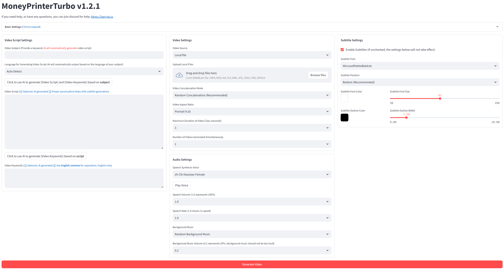
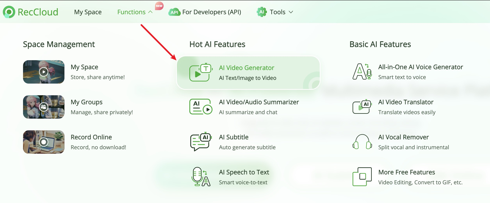

<div align="center">
<h1 align="center">MoneyPrinterTurbo 💸</h1>

<p align="center">
  <a href="https://github.com/harry0703/MoneyPrinterTurbo/stargazers"></a>
  <a href="https://github.com/harry0703/MoneyPrinterTurbo/issues"></a>
  <a href="https://github.com/harry0703/MoneyPrinterTurbo/network/members"></a>
  <a href="https://github.com/harry0703/MoneyPrinterTurbo/blob/main/LICENSE"></a>
</p>

<h3>English | <a href="README.md">简体中文</a></h3>

<div align="center">
  <a href="https://trendshift.io/repositories/8731" target="_blank"></a>
</div>

Simply provide a <b>topic</b> or <b>keyword</b> for a video, and it will automatically generate the video copy, video
materials, video subtitles, and video background music before synthesizing a high-definition short video.

### WebUI



### API Interface


</div>

## Special Thanks 🙏

Due to the **deployment** and **usage** of this project, there is a certain threshold for some beginner users. We would
like to express our special thanks to

**RecCloud (AI-Powered Multimedia Service Platform)** for providing a free `AI Video Generator` service based on this
project. It allows for online use without deployment, which is very convenient.

<https://reccloud.com>



## Features 🎯

- [x] Complete **MVC architecture**, **clearly structured** code, easy to maintain, supports both `API`
  and `Web interface`
- [x] Supports **AI-generated** video copy, as well as **customized copy**
- [x] Supports various **high-definition video** sizes
  - [x] Portrait 9:16, `1080x1920`
  - [x] Landscape 16:9, `1920x1080`
- [x] Supports **batch video generation**, allowing the creation of multiple videos at once, then selecting the most
  satisfactory one
- [x] Supports setting the **duration of video clips**, facilitating adjustments to material switching frequency
- [x] Supports video copy in both **Chinese** and **English**
- [x] Supports **multiple voice** synthesis
- [x] Supports **subtitle generation**, with adjustable `font`, `position`, `color`, `size`, and also
  supports `subtitle outlining`
- [x] Supports **background music**, either random or specified music files, with adjustable `background music volume`
- [x] Video material sources are **high-definition** and **royalty-free**
- [x] Supports integration with various models such as **OpenAI**, **moonshot**, **Azure**, **gpt4free**, **one-api**,
  **qianwen**, **Google Gemini**, **Ollama** and more

❓[How to Use the Free OpenAI GPT-3.5 Model?](https://github.com/harry0703/MoneyPrinterTurbo/blob/main/README-en.md#common-questions-)

### Future Plans 📅

- [ ] Introduce support for GPT-SoVITS dubbing
- [ ] Enhance voice synthesis with large models for a more natural and emotionally resonant voice output
- [ ] Incorporate video transition effects to ensure a smoother viewing experience
- [ ] Improve the relevance of video content
- [ ] Add options for video length: short, medium, long
- [ ] Package the application into a one-click launch bundle for Windows and macOS for ease of use
- [ ] Enable the use of custom materials
- [ ] Offer voiceover and background music options with real-time preview
- [ ] Support a wider range of voice synthesis providers, such as OpenAI TTS, Azure TTS
- [ ] Automate the upload process to the YouTube platform

## Video Demos 📺

### Portrait 9:16

<table>
<thead>
<tr>
<th align="center"><g-emoji class="g-emoji" alias="arrow_forward">▶️</g-emoji> How to Add Fun to Your Life </th>
<th align="center"><g-emoji class="g-emoji" alias="arrow_forward">▶️</g-emoji> What is the Meaning of Life</th>
</tr>
</thead>
<tbody>
<tr>
<td align="center">[](https://github.com/harry0703/MoneyPrinterTurbo/assets/4928832/a84d33d5-27a2-4aba-8fd0-9fb2bd91c6a6)</td>
<td align="center">[](https://github.com/harry0703/MoneyPrinterTurbo/assets/4928832/a84d33d5-27a2-4aba-8fd0-9fb2bd91c6a6)</td>
</tr>
</tbody>
</table>

### Landscape 16:9

<table>
<thead>
<tr>
<th align="center"><g-emoji class="g-emoji" alias="arrow_forward">▶️</g-emoji> What is the Meaning of Life</th>
<th align="center"><g-emoji class="g-emoji" alias="arrow_forward">▶️</g-emoji> Why Exercise</th>
</tr>
</thead>
<tbody>
<tr>
<td align="center"></td>
<td align="center"></td>
</tr>
</tbody>
</table>

## System Requirements 📦

- Recommended minimum 4 CPU cores or more, 8G of memory or more, GPU is not required
- Windows 10 or MacOS 11.0, and their later versions

## Installation & Deployment 📥

- Try to avoid using **Chinese paths** to prevent unpredictable issues
- Ensure your **network** is stable, meaning you can access foreign websites normally

#### ① Clone the Project

```shell
git clone https://github.com/harry0703/MoneyPrinterTurbo.git
```

#### ② Modify the Configuration File

- Copy the `config.example.toml` file and rename it to `config.toml`
- Follow the instructions in the `config.toml` file to configure `pexels_api_keys` and `llm_provider`, and according to
  the llm_provider's service provider, set up the corresponding API Key

#### ③ Configure Large Language Models (LLM)

- To use `GPT-4.0` or `GPT-3.5`, you need an `API Key` from `OpenAI`. If you don't have one, you can set `llm_provider`
  to `g4f` (a free-to-use GPT library <https://github.com/xtekky/gpt4free>)

### Docker Deployment 🐳

#### ① Launch the Docker Container

If you haven't installed Docker, please install it first <https://www.docker.com/products/docker-desktop/>
If you are using a Windows system, please refer to Microsoft's documentation:

1. <https://learn.microsoft.com/en-us/windows/wsl/install>
2. <https://learn.microsoft.com/en-us/windows/wsl/tutorials/wsl-containers>

```shell
cd MoneyPrinterTurbo
docker-compose up
```

> Note：The latest version of docker will automatically install docker compose in the form of a plug-in, and the start command is adjusted to `docker compose up`

#### ② Access the Web Interface

Open your browser and visit <http://0.0.0.0:8501>

#### ③ Access the API Interface

Open your browser and visit <http://0.0.0.0:8080/docs> Or <http://0.0.0.0:8080/redoc>

### Manual Deployment 📦

#### ① Create a Python Virtual Environment

It is recommended to create a Python virtual environment
using [conda](https://conda.io/projects/conda/en/latest/user-guide/install/index.html)

```shell
git clone https://github.com/harry0703/MoneyPrinterTurbo.git
cd MoneyPrinterTurbo
conda create -n MoneyPrinterTurbo python=3.11
conda activate MoneyPrinterTurbo
pip install -r requirements.txt
```

#### ② Install ImageMagick

###### Windows

- Download <https://imagemagick.org/archive/binaries/ImageMagick-7.1.1-29-Q16-x64-static.exe>
- Install the downloaded ImageMagick, **do not change the installation path**
- Modify the `config.toml` configuration file, set `imagemagick_path` to your actual installation path (if you didn't
  change the path during installation, just uncomment it)

###### MacOS

```shell
brew install imagemagick
```

###### Ubuntu

```shell
sudo apt-get install imagemagick
```

###### CentOS

```shell
sudo yum install ImageMagick
```

#### ③ Launch the Web Interface 🌐

Note that you need to execute the following commands in the `root directory`